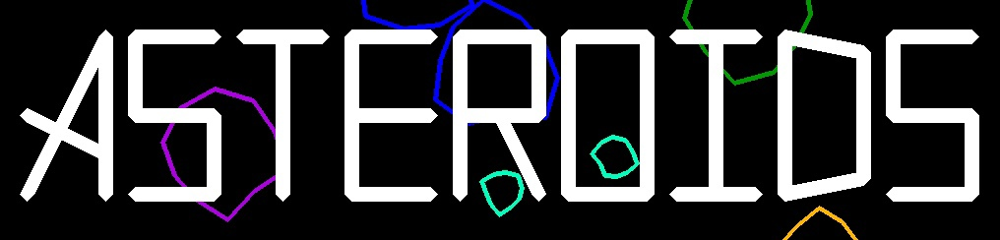

# Asteroids

## Translations
- [English](./README.md)
- [Russian](./README_ru.md)
## Геймплей

## Описание
Создан вариант игры Asteroids, используя исходный фреймворк. Цель игры управляя космическим кораблем уничтожать астероиды и набрать как можно большее количество очков до проигрыша игрока. Игра начинается после нажатия любой клавиши на начальном экране. Изначально у игрока имеется 3 жизни. За каждые 10.000 очков игроку добавляется одна жизнь, также возможно воскреснуть после смерти, если последние выстрелы заработают дополнительную жизнь. После потери жизни игрок становится неуязвимым на 5 секунд. Переход на следующий уровень происходит после уничтожения всех астероидов на уровне. 
Астероиды делятся на 3 вида:
Размер | Попаданий для уничтожения | Очки
--- | --- | ---
Крупный | 3 | 300
Средний | 2 | 200
Малый | 1 | 100

При попадании по астероиду его границы начинают темнеть. При уничтожении крупного или среднего астероида на месте уничтоженного появляются два астероида меньшего размера.
## Управление
### Клавиатура
- W или Стрелка вперед - ускорение
- A или Стрелка влево - поворот против часовой стрелки
- D или Стрелка вправо - поворот по часовой стрелке
- Пробел - выстрел
- Esc - выход
- P - пауза
- Enter - сброс прогресса игры
### Геймпад (xinput)
- DPad Вверх или Правый триггер - ускорение
- DPad Влево или Левый стик влево - поворот против часовой стрелки
- DPad Вправо или Левый стик вправо - поворот по часовой стрелки
- A - выстрел
- Back - выход
- Start - пауза
- Нажатие на правый стик - сброс прогресса игры
## Установка
### Windows
1. Скачать последнюю версию [игры](https://github.com/VampireVol/Asteroids/releases)
2. Извлечь .zip архив
3. Запустить GameTemplate.exe
## Build information
Инструменты сборки: Visual Studio 2019 (v142)